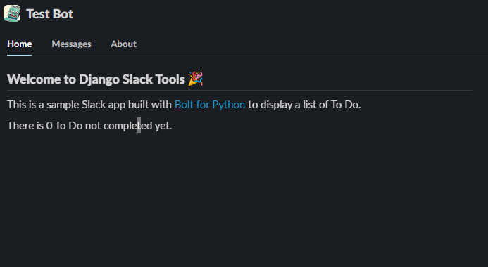
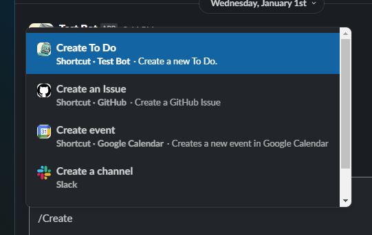
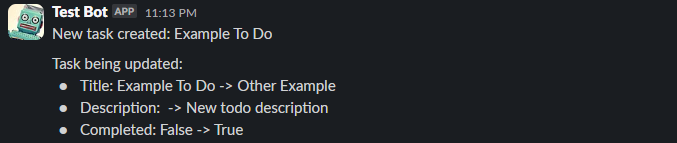

# Example To Do app

Simple To Do bot example built with `django-slack-tools`.

This is a simple demo application. I plan to add more useful and interesting examples in the future.

## ✨ Features

- Show recent To Do items from the app home
- Create or mark a To Do as done from Slack shortcuts via modals
- Notify a Slack channel when a To Do is created or updated using Django signals

## 🤖 Create Slack app

This example uses event subscription and messaging features. As Slack [documentation](https://api.slack.com/start/building/bolt-python) suggests, it is recommended to use [ngrok](https://ngrok.com/) for this.

Required scopes for the bot to fully work (including admin pages):

- `app_mentions:read`
- `channels:read`
- `chat:write`
- `chat:write.customize`
- `commands`
- `team:read`
- `usergroups:read`
- `users:read`

## 🚀 Run application

Run `just show` to install, configure, and run the application. Follow the instructions in the terminal. Once the server has started, open a new terminal and run `ngrok` for event subscription.

```bash
# Add auth token for ngrok if not set yet
$ ngrok config add-authtoken '...'

# Run ngrok server (with free static domain for later re-run) to get Slack events
$ ngrok http 8000 --domain '....ngrok.free.app'
```

Go to the Slack bot settings and configure event subscription with the generated ngrok URL. If you see 401 errors in ngrok traffic logs, check your bot credentials.

Once setup is complete, you will see the bot homepage like this:



Shortcuts are available in Slack chat if you type slash (/):



Create or update a To Do item to see messages.


